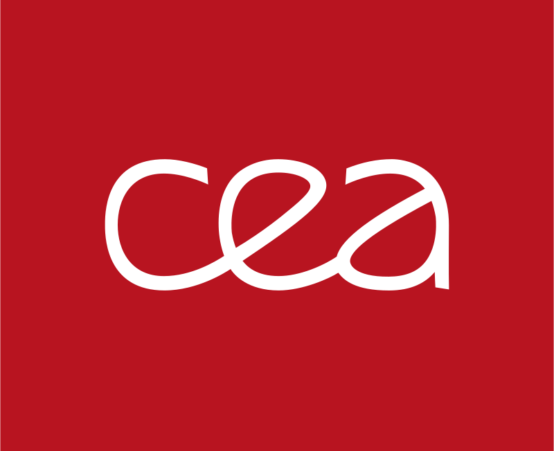

Welcome to the website for the workshop _Towards a theory of typical-case algorithmic hardness_, which will take place from the 27/01/2025 to the 7/02/2025 at the Les Houches Physics School in the French alps.

The workshop theme will be typical-case algorithmic hardness, with a special focus on creating bridges between the complementary approaches of theoretical computer science and statistical physics, identifying the crucial open question in the field and linking rigorous and non-rigorous methods.

We will have a set of in-depth lectures, many seminars covering state-of-the-art advances, a poster session, discussion time, and many occasions to explore the amazing surroundings of the school.

__Organisers:__  [Vittorio Erba](https://vittorioerba.github.io)  (EPFL, SPOC Lab.) and [Bruno Loureiro](https://brloureiro.github.io) (DI-ENS & CNRS, Paris)

## Confirmed lecturers

Afonso           Bandeira           	(ETHZ)           
David            Gamarnik           	(MIT)            
Florent          Krzakala               (EPFL)           
Federico         Ricci-Tersenghi	    (Sapienza)      

## Confirmed invited speakers

Maria Chiara     Angelini	            (Sapienza)            
Giulio           Biroli         	    (ENS)                 
Guy              Bresler                (MIT)                 
Antoine          Maillard           	(ETHZ)                
Laurent          Massoulié          	(INRIA Paris)         
Cris             Moore                  (Santa Fe Institute)  
Valentina        Ros            	    (Paris Saclay)        
Guilhem          Semerjian          	(ENS)                 
Luca             Trevisan           	(Bocconi)             
Alex             Wein           	    (UCD)                 
Ilias            Zadik          	    (Yale)                
Riccardo          Zecchina           	(Bocconi)             

## Applications

Applications will open on 1st September 2024, and the deadline will be on 31st October 2024 (you will find a link to the registration form on this site).
The selection of participants and of contributed speakers will take place shortly after the application deadline.
 
We warmly invite all applicants to apply either for a contributed talk or for a poster.

## Practical informations

- The workshop will take place from Monday 27/01/2025 to Friday 7/02/2025.
 
    Participants are expected to attend for the full duration of the event, arriving on Monday in the afternoon (after 15.00) and departing on Friday after lunch.

- Scientific activities will start on Tuesday 28/01 in the morning and will last up until Friday 7/02, morning included.
 
    The first week will focus on in-depth lectures, while the second week on conference-like seminars and poster sessions.
 
    Dedicated discussion time will also be planned to foster exchanges and collaborations.

- The cost of the workshop is still to be defined (we will update this page in the future). It will cover participation to the activities, accommodation and meals at the Les Houches School for the full duration of the workshop.
 
The first meal included is the dinner of Monday 27/01, and the last one is the lunch of Friday 7/02.

- More informations can be found on [the institute webpage](https://www.houches-school-physics.com/practical-information/).

<!-- - The poster of the event can be downloaded [here](poster.pdf) -->

## Contacts

For any question, write to [vittorio.erba@epfl.ch](mailto:vittorio.erba@epfl.ch) or to [bruno.loureiro@di.ens.fr](mailto:bruno.loureiro@di.ens.fr).

## The Les Houches Physics School

Les Houches is a village located in Chamonix valley, in the French Alps.

Established in 1951, the Physics School is situated at 1150 m above sea level in natural
surroundings, with breathtaking views on the Mont-Blanc mountain range.

Les Houches Physics School is UMS 2002 run by Université Grenoble Alpes (UGA).
 
The 5 School Partners are UGA, the Institut National Polytechnique (Grenoble-INP),
the Centre National de la Recherche Scientifique (CNRS),
the Commissariat à l'Energie Atomique (CEA), and
the Ecole Normale Supérieure de Lyon (ENS Lyon).

Ecole de Physique des Houches, 
149 Chemin de la Côte, F-74310 Les Houches, France 
[https://houches-school-physics.com](https://houches-school-physics.com) 

## Sponsors

&nbsp;&nbsp;&nbsp;&nbsp;&nbsp;&nbsp;&nbsp;&nbsp;

&nbsp;&nbsp;&nbsp;&nbsp;&nbsp;&nbsp;&nbsp;&nbsp;

## Partners

&nbsp;&nbsp;&nbsp;&nbsp;&nbsp;&nbsp;&nbsp;&nbsp;

&nbsp;&nbsp;&nbsp;&nbsp;&nbsp;&nbsp;&nbsp;&nbsp;

&nbsp;&nbsp;&nbsp;&nbsp;&nbsp;&nbsp;&nbsp;&nbsp;

&nbsp;&nbsp;&nbsp;&nbsp;&nbsp;&nbsp;&nbsp;&nbsp;

